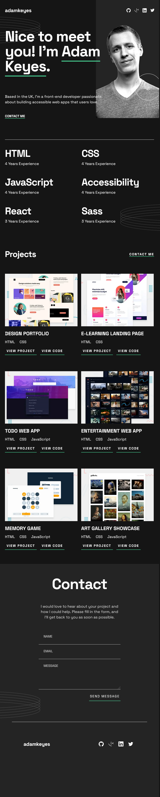
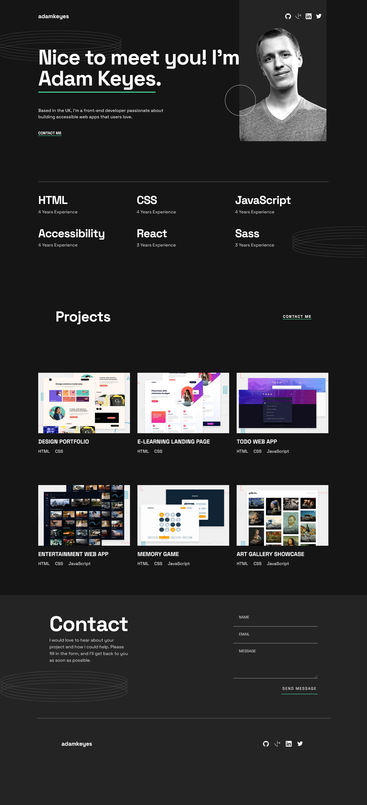

# Frontend Mentor - Single-page developer portfolio solution

This is a solution to the [Single-page developer portfolio challenge on Frontend Mentor](https://www.frontendmentor.io/challenges/singlepage-developer-portfolio-bBVj2ZPi-x). Frontend Mentor challenges help you improve your coding skills by building realistic projects. 

## Table of contents

- [Overview](#overview)
  - [The challenge](#the-challenge)
  - [Screenshot](#screenshot)
  - [Links](#links)
- [My process](#my-process)
  - [Built with](#built-with)
  - [What I learned](#what-i-learned)
  - [Continued development](#continued-development)
  - [Useful resources](#useful-resources)
- [Author](#author)

## Overview

### The challenge

Users should be able to:

- Receive an error message when the `form` is submitted if:
  - Any field is empty
  - The email address is not formatted correctly
- View the optimal layout for the interface depending on their device's screen size
- See hover and focus states for all interactive elements on the page

### Screenshot

| Mobile | Tablet | Desktop |
| ------ | ------ | ------- |
|  |  |  |

### Links

- Solution URL: [Add solution URL here](https://www.frontendmentor.io/solutions/developer-portfolio-using-css-grid-and-flexbox-3gGwv2y76L)
- Live Site URL: [Live site URL here](https://doileo.github.io/developer-porfolio/)

## My process

### Built with

- Semantic HTML5 markup
- CSS custom properties
- Flexbox
- CSS Grid
- Mobile-first workflow
- JavaScript

### What I learned

Throughout this project, I gained valuable insights and learning experiences. Some of the key learnings include:
- Implementing form validation using JavaScript.
- Utilizing code snippets to highlight specific areas of the project.

### Continued development

In future projects, I aim to focus on the following areas:
- Further improving my understanding of JavaScript concepts.
- Refining and perfecting techniques that proved useful in this project.

### Useful resources

- [Resource 1](https://developer.mozilla.org/en-US/docs/Web/JavaScript/Guide/Regular_Expressions) - Regular expressions are powerful tools for pattern matching and validation. The Mozilla Developer Network (MDN) guide on regular expressions in JavaScript provides detailed explanations and examples which helped me understand and utilize regex effectively.
- [Resource 2](https://developer.mozilla.org/en-US/docs/Web/API/Element/classList) - The MDN documentation on classList provides detailed information and examples on how to add, remove, toggle, and check for classes using JavaScript. 

## Author

- Website - [Doina](https://doileo.github.io/portfolio/)
- Frontend Mentor - [@Doileo](https://www.frontendmentor.io/profile/Doileo)
